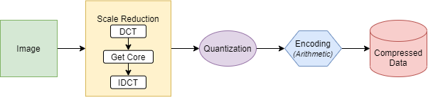

# Simple Compression and Decompression Model

## Compression and Decompression Model
### Compression model
[](doc/compress.png)
1. Scale Reduction<br>
This block includes 3 steps. **DCT** is using to convert original image to 2d frequency domain. **Get Core** is using to cut and get the low power frequency. **IDCT** is using to inverse to spatial domain, is this time, the size of image is scaled down
2. Quantization<br>
Using to resize the pixel value and easy to encode
3. Encoding<br>
Using **Arithmetic** coding to encode
### Decompression model
[](doc/decompress.png)
1. Decoding <br>
Using **Arithmetic** coding to decode
2. De-Quantization<br>
Convert to original value in image and compensate the error follow *uniform distribution*
3. Scale Increasing<br>
This block includes 3 steps. **DCT** is using to convert original image to 2d frequency domain. **Get Origin** is using to resize image to original size and add high power frequency is zero. **IDCT** is using to inverse to spatial domain, is this time, the size of image is original
4. Compensation <br>
Using to compensate the image with 2 compensated steps to reduce the error with original image before compression: *Edge offset* compensate the lost of edge in **Scale Reduction** block. *Gaussian offset* compensate the lost in general.
# Requirements
``` bash
Python >= 3.6
numpy, opencv, matplotlib
```

## Download and install reference
``` bash
$ git clone https://github.com/DuyNamUET/image_compressor
$ pip install requirements.txt      # Window 10
$ pip3 install requirements.txt     # Ubuntu
```

## Run
``` bash
$ cd image_compressor
$ python scripts/main.py
```
